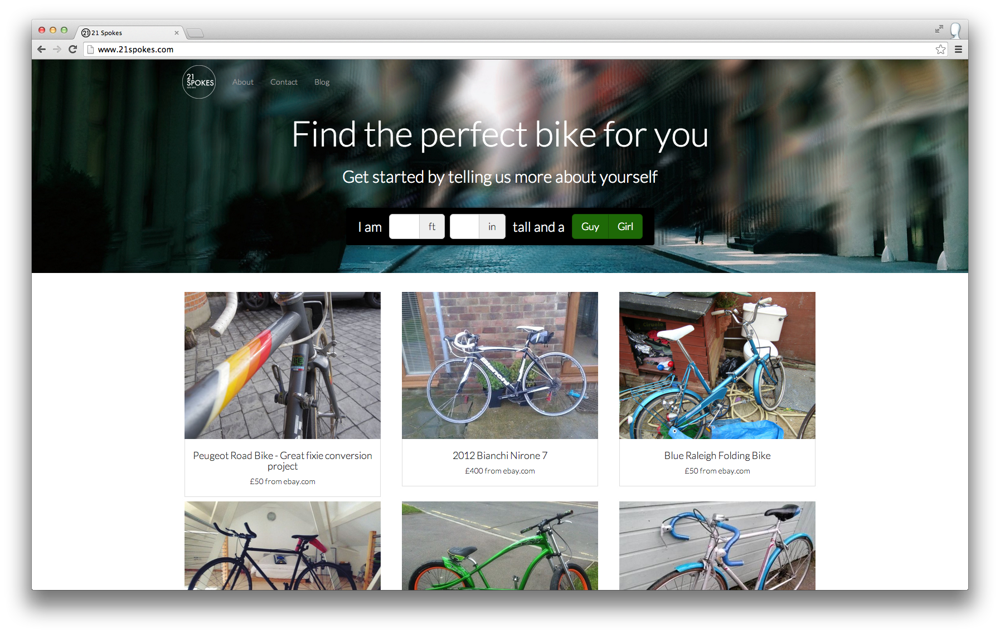
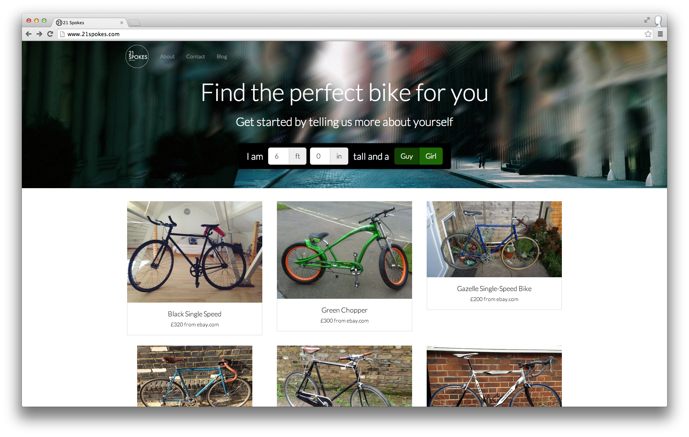
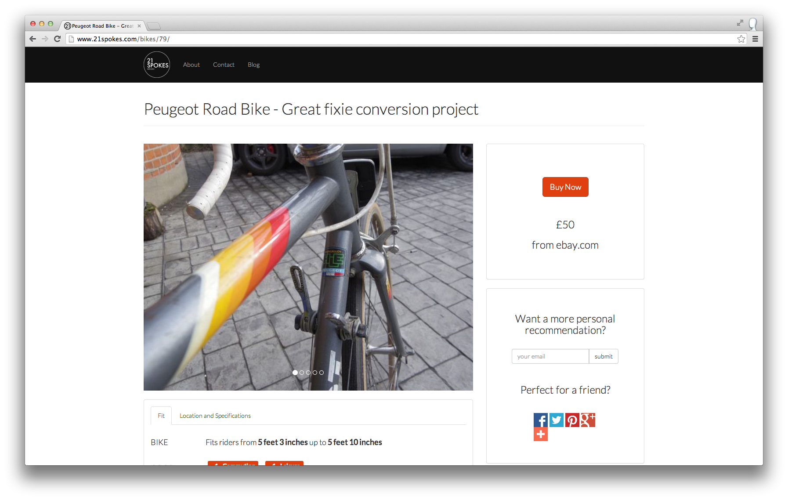
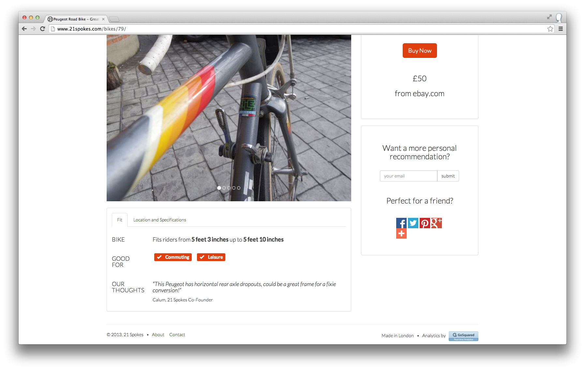
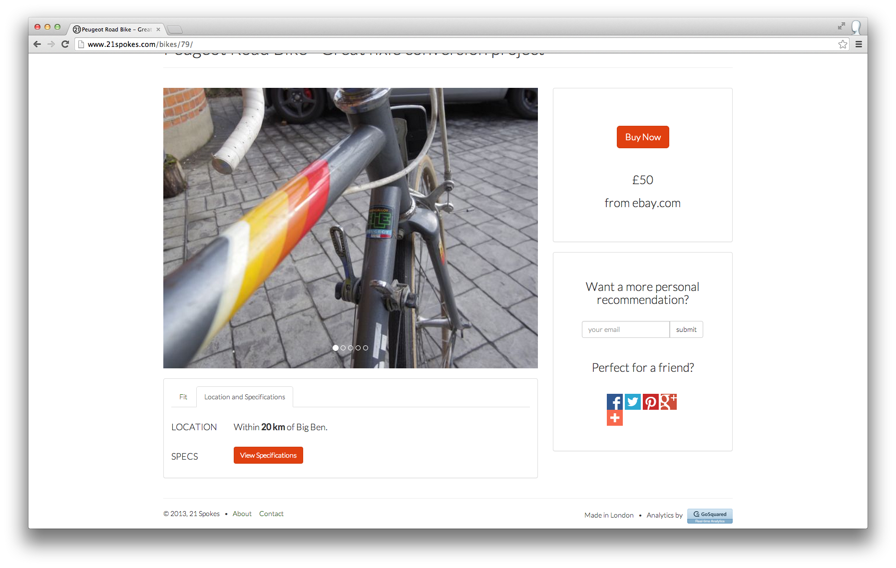
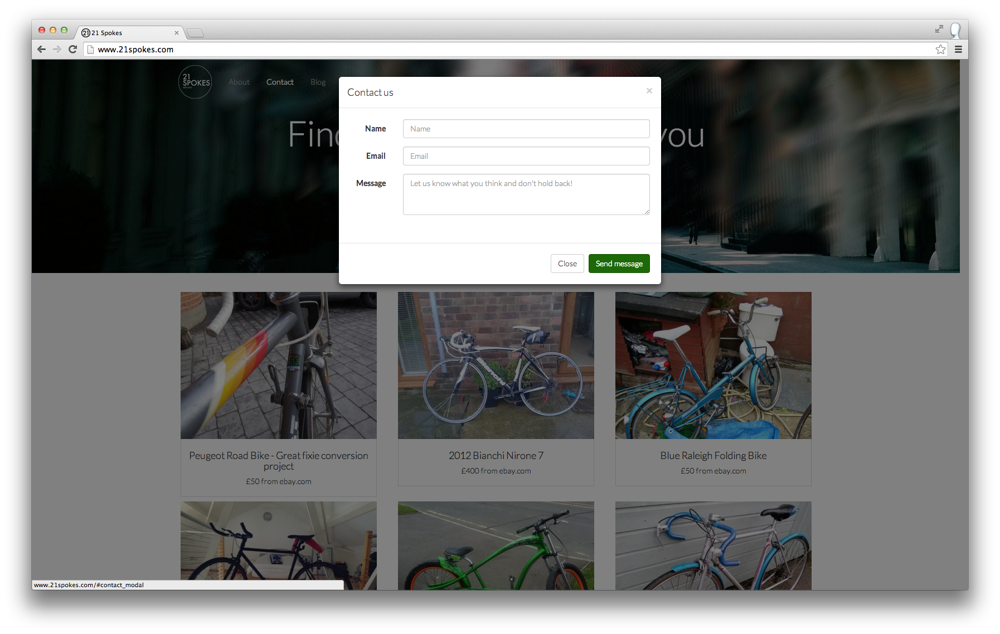
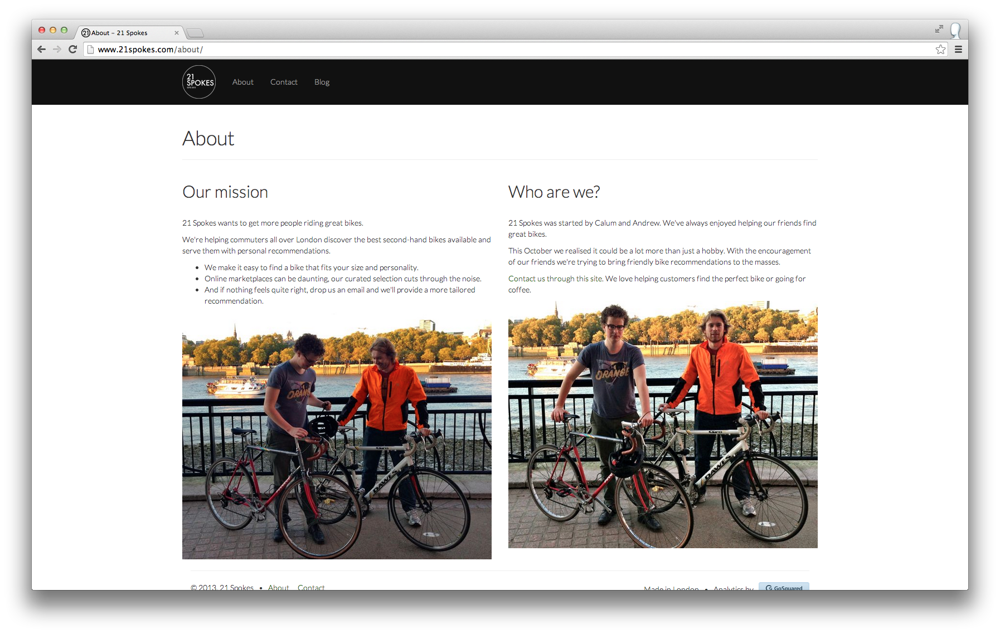

Product Decisions MVP
=====================

A prototype for exploring buying decisions.

Screenshots
-----------
















Made with
---------

- Django
- Vagrant
- Heroku
- Bootstrap
- Google Forms
- Google Analytics
- GoSquared
- Skimlinks
- Angular
- Heroku Data Clips

---

Resources
---------

http://www.ebay.co.uk/itm/FALCON-58CM-VINTAGE-ROAD-BIKE-REYNOLDS-531-5-SPEED-PURPLE-/300997251850

https://github.com/angular/angular-seed

https://devcenter.heroku.com/articles/heroku-postgresql

https://github.com/ejholmes/vagrant-heroku

https://devcenter.heroku.com/articles/pgbackups

https://github.com/scottmuc/vagrant-postgresql

Local Development
-----------------

Starting your local machine.

```sh
git clone git@github.com:CalumJEadie/product-decisions-mvp.git
cd product-decisions-mvp
./start.sh
```

View at http://127.0.0.1:8000.

Stopping your local machine.

```sh
./stop.sh
```

Heroku Configuration
--------------------

Name: product-decisions-mvp
Region: Europe
Stack: Cedar
Add ons:
- Heroku Postgres Dev :: blue
- PG Backups, for backing up the Postgres DB